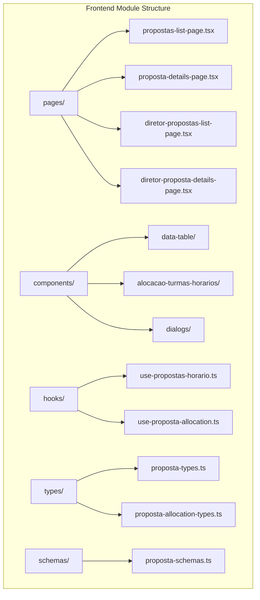
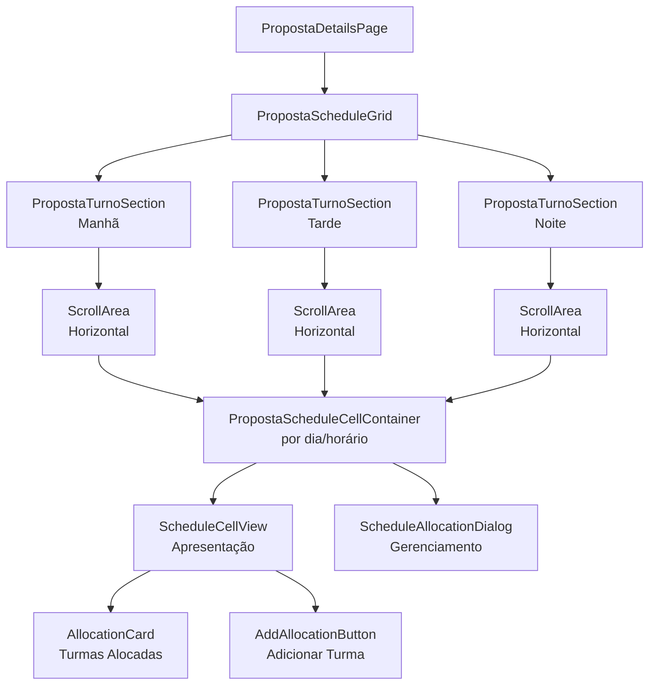
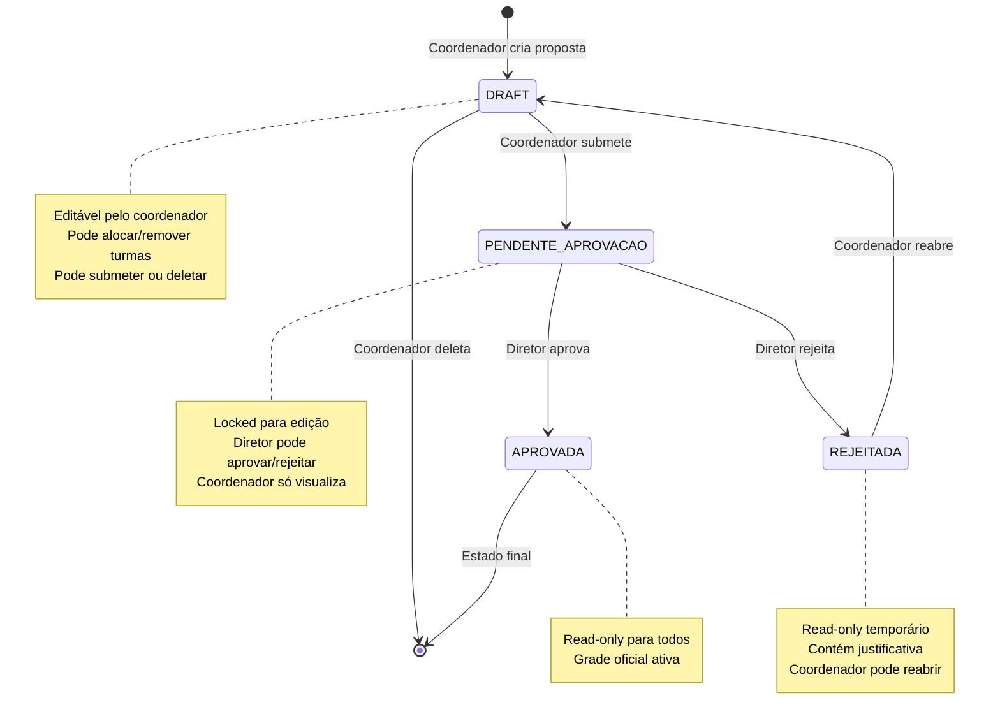
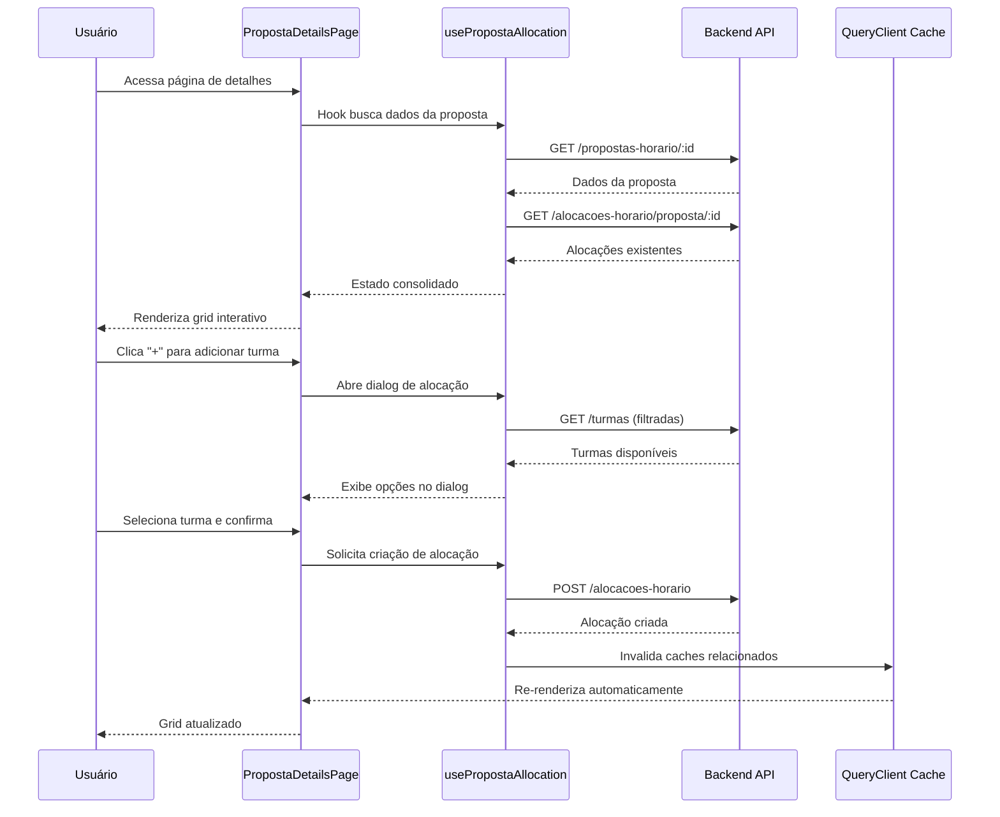
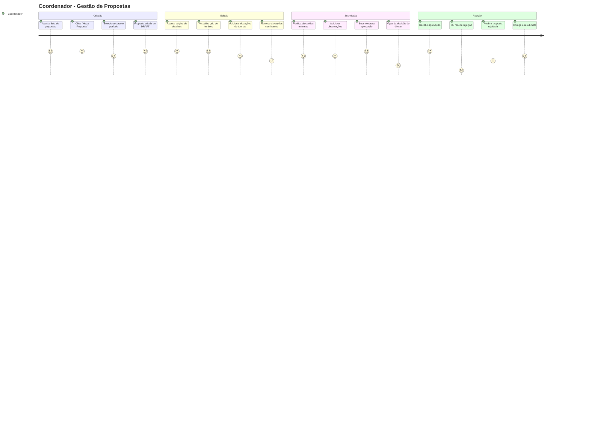
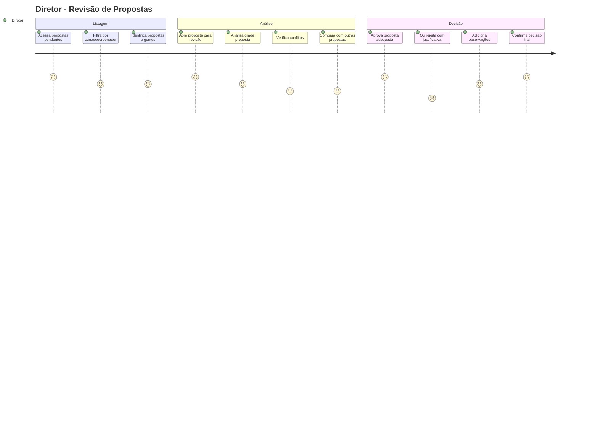

# 📊 Módulo Propostas de Horário

## 📑 **Índice**

- [🎯 Visão Geral](#-visão-geral)
- [📊 Diagramas da Arquitetura](#-diagramas-da-arquitetura)
- [📁 Estrutura do Módulo](#-estrutura-do-módulo)
- [🔄 Fluxo de Estados das Propostas](#-fluxo-de-estados-das-propostas)
- [🎨 Hierarquia de Componentes do Grid](#-hierarquia-de-componentes-do-grid)
- [🌊 Fluxo de Dados](#-fluxo-de-dados)
- [👥 Fluxos de Usuário](#-fluxos-de-usuário)
- [🔐 Sistema de Permissões](#-sistema-de-permissões)
- [⚡ Funcionalidades Implementadas](#-funcionalidades-implementadas)
- [🚧 Funcionalidades Pendentes](#-funcionalidades-pendentes)
- [🎯 Principais Benefícios](#-principais-benefícios)

---

## 🎯 **Visão Geral**

O módulo **Propostas de Horário** é um sistema completo para gerenciar propostas de grade horária em uma instituição educacional. Permite que coordenadores criem, editem e submetam propostas de horários, enquanto diretores podem revisá-las, aprová-las ou rejeitá-las com justificativas.

### **Principais Características:**

- **Workflow de Aprovação**: Sistema de estados com transições controladas
- **Interface Visual Interativa**: Grid de horários com drag-and-drop conceitual
- **Validação de Conflitos**: Verificação automática de sobreposições de horários
- **Controle de Permissões**: Diferentes níveis de acesso por papel e status
- **Auditoria Completa**: Rastreamento de alterações e justificativas

---

## 📊 **Diagramas da Arquitetura**

### **Estrutura Geral do Módulo**

### **Hierarquia de Componentes do Grid de Alocação**

---

## 📁 **Estrutura do Módulo**

### **Organização por Responsabilidade**

**Types & Schemas**: Definições de tipos TypeScript e validações Zod para garantir type safety e validação de formulários.

**Hooks**: Camada de abstração que combina os hooks gerados automaticamente pelo Orval com lógica específica do negócio, gerenciamento de cache e tratamento de erros.

**Components**:

- **data-table/**: Componentes para listagem e filtros de propostas
- **alocacao-turmas-horarios/**: Sistema completo de grid interativo para alocação
- **dialogs/**: Modais para criação, submissão, aprovação e rejeição

**Pages**: Páginas principais que orquestram os componentes e definem os layouts para coordenadores e diretores.

---

## 🔄 **Fluxo de Estados das Propostas**

---

## 🎨 **Hierarquia de Componentes do Grid**

### **Arquitetura de Apresentação vs Lógica**

O grid segue o padrão Container/Presentational Components:

**PropostaScheduleGrid**: Componente principal que busca dados e coordena os turnos.

**PropostaTurnoSection**: Gerencia um turno específico (Manhã/Tarde/Noite) com scroll horizontal.

**PropostaScheduleCellContainer**: Container com lógica de negócio para cada célula (dia + horário específico).

**ScheduleCellView**: Componente puramente visual que apresenta alocações e botões.

**AllocationCard**: Card compacto que exibe informações de uma turma alocada.

**AddAllocationButton**: Botão inteligente que se adapta ao contexto e permissões.

### **Sistema de Scroll Inteligente**

Cada turno possui scroll horizontal independente para acomodar a grade semanal completa. As células têm largura fixa (300px) garantindo consistência visual.

---

## 🌊 **Fluxo de Dados**

---

## 👥 **Fluxos de Usuário**

### **Coordenador - Fluxo Completo**

### **Diretor - Fluxo de Aprovação**

---

## 🔐 **Sistema de Permissões**

### **Matriz de Permissões por Status**

| Status        | Coordenador Pode                                   | Diretor Pode               | Sistema Permite         |
| ------------- | -------------------------------------------------- | -------------------------- | ----------------------- |
| **DRAFT**     | ✅ Editar alocações ✅ Submeter ✅ Deletar | ❌ Apenas visualizar       | ✅ Todas as operações   |
| **PENDENTE**  | ❌ Apenas visualizar                               | ✅ Aprovar ✅ Rejeitar | ❌ Locked para edição   |
| **APROVADA**  | ❌ Read-only                                       | ❌ Read-only               | ❌ Estado final         |
| **REJEITADA** | ✅ Reabrir ❌ Editar direto                    | ❌ Apenas visualizar       | ✅ Reabertura permitida |

### **Controle de Interface**

A interface se adapta automaticamente baseada no status da proposta e papel do usuário:

- **Botões contextuais**: Aparecem/desaparecem conforme permissões
- **Indicadores visuais**: Status badges com cores específicas
- **Modo read-only**: Grid desabilita interações quando necessário
- **Mensagens contextuais**: Explicam limitações e próximos passos

---

## ⚡ **Funcionalidades Implementadas**

### ✅ **Sistema Básico Completo**

- Criação e listagem de propostas
- Grid de alocação interativo com scroll horizontal
- Sistema de tipos e validações
- Integração completa com backend via Orval
- Componentes de data table com filtros

### ✅ **Grid de Alocação Avançado**

- Suporte a múltiplas turmas por slot
- AllocationCard responsivo com 3 tamanhos
- AddAllocationButton inteligente
- ScheduleAllocationDialog otimizado
- Validação de conflitos em tempo real

### ✅ **Arquitetura Robusta**

- Separação clara entre propostas e sistema geral
- Hooks customizados com cache inteligente
- Types específicos organizados
- Barrel files limpos e organizados

---

## 🚧 **Funcionalidades Pendentes**

### ❌ **Task 4.3 - Estados Condicionais da Interface**

- Modo visualização para propostas aprovadas/rejeitadas
- Indicadores visuais de status e permissões na interface

### ❌ **Task 4.4-4.9 - Funcionalidades de Submissão**

- Botão "Submeter" para propostas em DRAFT
- Dialog de submissão com observações
- Visualização read-only para propostas PENDENTE e APROVADA
- Exibição de justificativas de rejeição
- Botão "Reabrir para Edição" para propostas REJEITADAS

### ❌ **Task 6.0 - Fluxo de Aprovação Completo**

- Dialog de aprovação com observações opcionais
- Dialog de rejeição com justificativa obrigatória
- Implementação das ações de aprovação/rejeição via API
- Ação de reabertura para coordenadores
- Botões de aprovação/rejeição na página de detalhes
- Controle de permissões baseado no papel do usuário
- Confirmações antes de ações irreversíveis

### **Status Atual de Implementação:**

- **Completo**: Tasks 1.0, 2.0, 3.0, 4.1, 4.2, 5.0
- **Pendente**: Tasks 4.3-4.9, 6.0
- **Progresso**: ~70% do sistema implementado

---

## 🎯 **Principais Benefícios**

### **📋 Manutenibilidade**

- Arquitetura modular com responsabilidades bem definidas
- Separação clara entre lógica de negócio e apresentação
- Types centralizados garantindo consistência

### **⚡ Performance**

- Cache inteligente com invalidação específica
- Componentes otimizados para re-renderização mínima
- Scroll virtual para grids grandes

### **🔒 Segurança**

- Validação dupla (frontend + backend)
- Controle de permissões granular
- Type safety completo

### **👥 Experiência do Usuário**

- Interface intuitiva com feedback visual imediato
- Grid responsivo que se adapta ao conteúdo
- Workflows claros para coordenadores e diretores

### **🔧 Developer Experience**

- Hooks gerados automaticamente do Swagger
- Types compartilhados entre frontend e backend
- Arquitetura padronizada e documentada

---

**🚀 Este módulo representa uma implementação robusta e escalável que combina as melhores práticas do React/TypeScript com um workflow de negócio bem estruturado. A arquitetura suporta facilmente a adição das funcionalidades pendentes mantendo a qualidade e consistência do código.**
