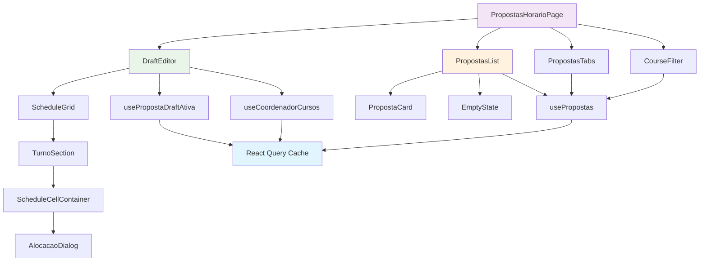
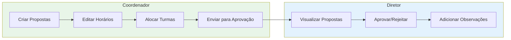
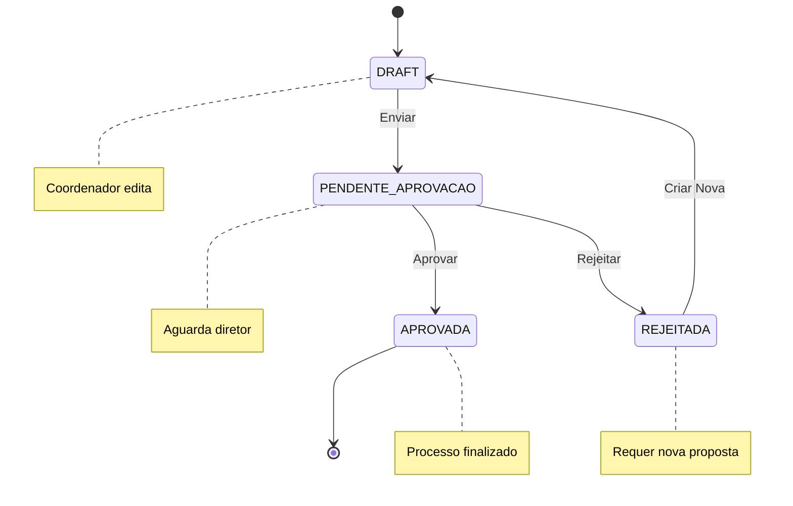
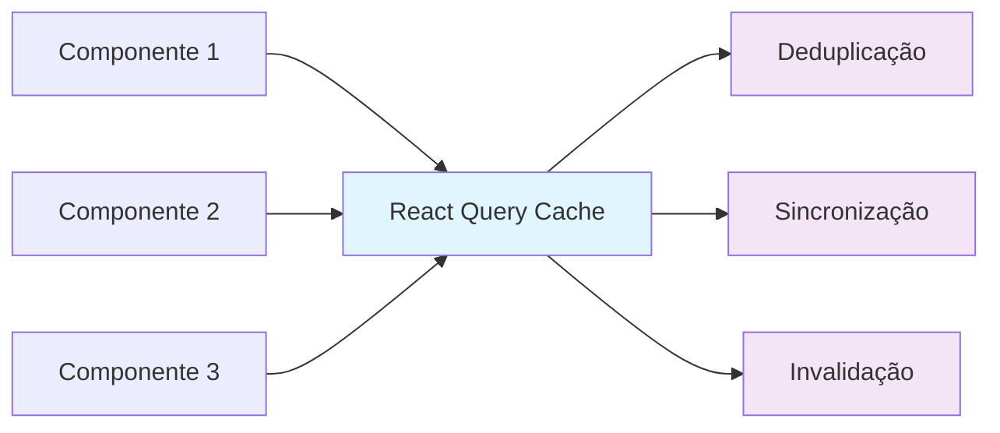

# 📅 Feature: Propostas de Horário

Sistema para criação, edição e aprovação de propostas de horário acadêmico, com arquitetura moderna baseada em componentes independentes e React Query.

## 🎯 Visão Geral

Esta feature permite que coordenadores criem propostas de horário para seus cursos e que diretores aprovem ou rejeitem essas propostas. O sistema foi projetado com foco em:

- **Componentes independentes** - Cada componente faz suas próprias queries
- **Cache automático** - React Query gerencia cache e sincronização
- **Zero prop drilling** - Eliminação de passagem excessiva de props
- **Responsabilidade única** - Cada componente tem uma responsabilidade específica

## 🏗️ Arquitetura

### Fluxo de Dados


```mermaid
graph TD
    A[PropostasHorarioPage] --> B[PropostasTabs]
    A --> C[DraftEditor]
    A --> D[PropostasList]
    A --> E[CourseFilter]

    C --> F[ScheduleGrid]
    C --> G[usePropostaDraftAtiva]
    C --> H[useCoordenadorCursos]

    D --> I[PropostaCard]
    D --> J[EmptyState]
    D --> K[usePropostas]

    B --> K
    E --> K

    F --> L[TurnoSection]
    L --> M[ScheduleCellContainer]
    M --> N[AlocacaoDialog]

    G --> O[React Query Cache]
    H --> O
    K --> O

    style O fill:#e1f5fe
    style A fill:#f3e5f5
    style C fill:#e8f5e8
    style D fill:#fff3e0
```

### Papéis de Usuário


```mermaid
flowchart LR
    subgraph Coordenador
        A[Criar Propostas] --> B[Editar Horários]
        B --> C[Alocar Turmas]
        C --> D[Enviar para Aprovação]
    end

    subgraph Diretor
        E[Visualizar Propostas] --> F[Aprovar/Rejeitar]
        F --> G[Adicionar Observações]
    end

    D --> E

    style Coordenador fill:#e8f5e8
    style Diretor fill:#e3f2fd
```

## 📁 Estrutura de Arquivos

```
propostas-horario/
├── README.md                    # Esta documentação
├── index.ts                     # Exports principais
├── components/                  # Componentes da feature
│   ├── index.ts                # Exports dos componentes
│   ├── draft-editor.tsx        # Editor de propostas em rascunho
│   ├── propostas-list.tsx      # Lista paginada de propostas
│   ├── propostas-tabs.tsx      # Navegação entre abas
│   ├── course-filter.tsx       # Filtro por curso (diretores)
│   ├── empty-states.tsx        # Estados vazios reutilizáveis
│   ├── proposta-card.tsx       # Card individual de proposta
│   ├── schedule-grid.tsx       # Grade de horários
│   ├── schedule-cell-*.tsx     # Componentes da célula de horário
│   ├── turno-section.tsx       # Seção de turno (manhã/tarde/noite)
│   ├── alocacao-dialog.tsx     # Modal para gerenciar alocações
│   └── modals/                 # Modais específicos
│       ├── approve-modal.tsx   # Modal de aprovação
│       └── reject-modal.tsx    # Modal de rejeição
├── hooks/                      # Hooks customizados
│   ├── index.ts               # Exports dos hooks
│   ├── use-propostas.ts       # Hook principal para propostas
│   ├── use-create-proposta.ts # Criação de propostas
│   ├── use-actions.ts         # Ações (enviar/aprovar/rejeitar)
│   ├── use-coordenador-cursos.ts # Cursos do coordenador
│   ├── use-periodo-ativo.ts   # Período letivo ativo
│   ├── use-proposta-draft-ativa.ts # Proposta draft ativa
│   └── use-schedule-allocation.ts # Alocações de horário
└── pages/                     # Páginas da feature
    ├── index.ts              # Exports das páginas
    └── propostas-horario-page.tsx # Página principal
```

## 🧩 Componentes Principais

### 1. **PropostasHorarioPage**

Página principal que orquestra os componentes. Mantém apenas estados mínimos:

- Aba ativa
- Filtro de curso
- Estados dos modais

### 2. **DraftEditor** (Independente)

Componente para edição de propostas em rascunho.

**Queries próprias:**

- `useAuth` - Dados do usuário
- `useCoordenadorCursos` - Cursos do coordenador
- `usePeriodoAtivoId` - Período ativo
- `usePropostaDraftAtiva` - Proposta draft ativa
- `useAlocacoesHorariosControllerFindMany` - Alocações

**Responsabilidades:**

- Criar nova proposta
- Exibir grade de horários para edição
- Validar se pode enviar proposta
- Enviar proposta para aprovação

### 3. **PropostasList** (Independente)

Lista paginada de propostas com filtros.

**Queries próprias:**

- `usePropostas` - Lista de propostas
- `useAuth` - Papel do usuário

**Responsabilidades:**

- Filtrar propostas por status e curso
- Paginação interna
- Exibir cards de propostas
- Estados vazios apropriados

### 4. **PropostasTabs** (Independente)

Navegação entre abas com contadores automáticos.

**Queries próprias:**

- `usePropostas` - Para calcular contadores

**Responsabilidades:**

- Calcular contadores por status
- Navegação responsiva
- Indicadores visuais

### 5. **CourseFilter** (Independente)

Filtro de cursos para diretores.

**Queries próprias:**

- `usePropostas` - Para extrair cursos únicos

**Responsabilidades:**

- Extrair cursos das propostas
- Interface de seleção
- Feedback visual

## 🔄 Fluxo de Estados

### Estado de Propostas


```mermaid
stateDiagram-v2
    [*] --> DRAFT
    DRAFT --> PENDENTE_APROVACAO : Enviar
    PENDENTE_APROVACAO --> APROVADA : Aprovar
    PENDENTE_APROVACAO --> REJEITADA : Rejeitar
    REJEITADA --> DRAFT : Criar Nova
    APROVADA --> [*]

    note right of DRAFT : Coordenador edita
    note right of PENDENTE_APROVACAO : Aguarda diretor
    note right of APROVADA : Processo finalizado
    note right of REJEITADA : Requer nova proposta
```

### Cache do React Query


```mermaid
graph LR
    A[Componente 1] --> C[React Query Cache]
    B[Componente 2] --> C
    D[Componente 3] --> C

    C --> E[Deduplicação]
    C --> F[Sincronização]
    C --> G[Invalidação]

    style C fill:#e1f5fe
    style E fill:#f3e5f5
    style F fill:#f3e5f5
    style G fill:#f3e5f5
```

## 🎣 Hooks Customizados

### Hooks Principais

| Hook                | Responsabilidade            | Retorna                                               |
| ------------------- | --------------------------- | ----------------------------------------------------- |
| `usePropostas`      | Buscar propostas do usuário | `propostas[]`, `contadores`, `canViewAll`             |
| `useActions`        | Ações de proposta           | `submitProposta`, `approveProposta`, `rejectProposta` |
| `useCreateProposta` | Criar nova proposta         | `createProposta`, `isCreating`                        |

### Hooks de Apoio

| Hook                    | Responsabilidade      | Retorna                                   |
| ----------------------- | --------------------- | ----------------------------------------- |
| `useCoordenadorCursos`  | Cursos do coordenador | `cursos[]`, `cursoPrincipal`, `hasCursos` |
| `usePeriodoAtivo`       | Período letivo ativo  | `periodoAtivo`, `periodoAtivoId`          |
| `usePropostaDraftAtiva` | Proposta draft ativa  | `propostaDraftAtiva`, `hasDraftAtiva`     |
| `useScheduleAllocation` | Alocações de horário  | `criarAlocacao`, `removerAlocacao`        |

## 🎨 Padrões de Design

### 1. **Componentes Independentes**

```typescript
// ❌ Antes (prop drilling)
<PropostasList
  propostas={propostas}
  isLoading={isLoading}
  contadores={contadores}
  onAprovar={onAprovar}
  // ... 10+ props
/>

// ✅ Depois (independente)
<PropostasList
  tabType="pendente"
  onAprovar={handleAprovar}
/>
```

### 2. **React Query Cache**

```typescript
// Múltiplos componentes fazem a mesma query
// React Query deduplica automaticamente
const { propostas } = usePropostas() // Componente A
const { propostas } = usePropostas() // Componente B (usa cache)
```

### 3. **Estados Mínimos**

```typescript
// Página mantém apenas estados essenciais
const [activeTab, setActiveTab] = useState("draft")
const [filterCourse, setFilterCourse] = useState("")
// Componentes gerenciam seus próprios estados
```

## 🚀 Funcionalidades

### Para Coordenadores

- ✅ Visualizar propostas próprias
- ✅ Criar nova proposta para seu curso
- ✅ Editar proposta em rascunho
- ✅ Alocar turmas na grade de horários
- ✅ Validar conflitos de professor/horário
- ✅ Enviar proposta para aprovação

### Para Diretores

- ✅ Visualizar todas as propostas
- ✅ Filtrar propostas por curso
- ✅ Aprovar propostas com observações
- ✅ Rejeitar propostas com justificativa
- ✅ Visualizar histórico de ações

## 🎯 Benefícios da Arquitetura

### 1. **Performance**

- Cache automático do React Query
- Deduplicação de requests
- Invalidação inteligente

### 2. **Manutenibilidade**

- Componentes com responsabilidade única
- Zero prop drilling
- Código mais limpo e testável

### 3. **Reusabilidade**

- Componentes independentes
- Hooks reutilizáveis
- Estados vazios genéricos

### 4. **Desenvolvedor Experience**

- Hot reload mais eficiente
- Debug mais simples
- Testes isolados

## 📊 Métricas da Refatoração

| Métrica                       | Antes | Depois | Melhoria |
| ----------------------------- | ----- | ------ | -------- |
| **Linhas de código**          | 1.024 | 206    | -80%     |
| **Props no total**            | 40+   | 8      | -80%     |
| **Estados centralizados**     | 15+   | 3      | -80%     |
| **Prop drilling levels**      | 4-5   | 0      | -100%    |
| **Componentes reutilizáveis** | 2     | 8      | +300%    |

## 🔧 Como Usar

### 1. **Importar a página**

```typescript
import { PropostasHorarioPage } from "@/features/propostas-horario"
```

### 2. **Usar hooks independentemente**

```typescript
import { usePropostas, useActions } from "@/features/propostas-horario"

function MeuComponente() {
  const { propostas, isLoading } = usePropostas()
  const { submitProposta } = useActions()

  // Componente independente com suas próprias queries
}
```

### 3. **Reutilizar componentes**

```typescript
import { PropostaCard, EmptyState } from '@/features/propostas-horario'

function MinhaLista() {
  return (
    <div>
      {propostas.map(proposta => (
        <PropostaCard key={proposta.id} proposta={proposta} />
      ))}
      {propostas.length === 0 && (
        <EmptyState type="draft" isCoordenador={true} />
      )}
    </div>
  )
}
```

## 🎓 Lições Aprendidas

1. **React Query elimina prop drilling** - Componentes podem fazer suas próprias queries sem impacto na performance
2. **Cache automático é poderoso** - A mesma query em múltiplos componentes é automaticamente otimizada
3. **Componentes independentes são mais testáveis** - Cada componente pode ser testado isoladamente
4. **Estados mínimos melhoram performance** - Menos re-renders desnecessários

---

_Esta feature representa um exemplo de arquitetura moderna React com foco em performance, manutenibilidade e experiência do desenvolvedor._
