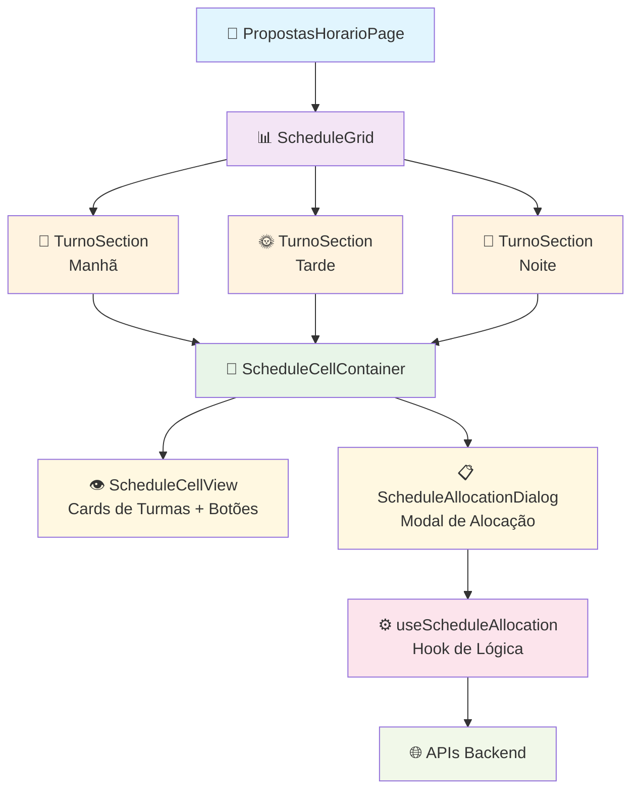
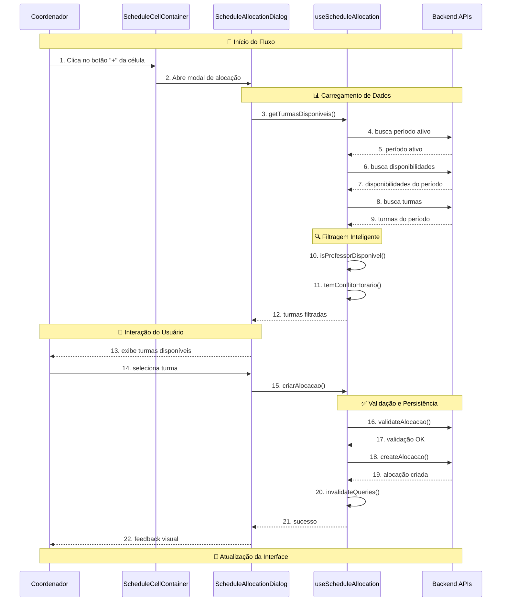
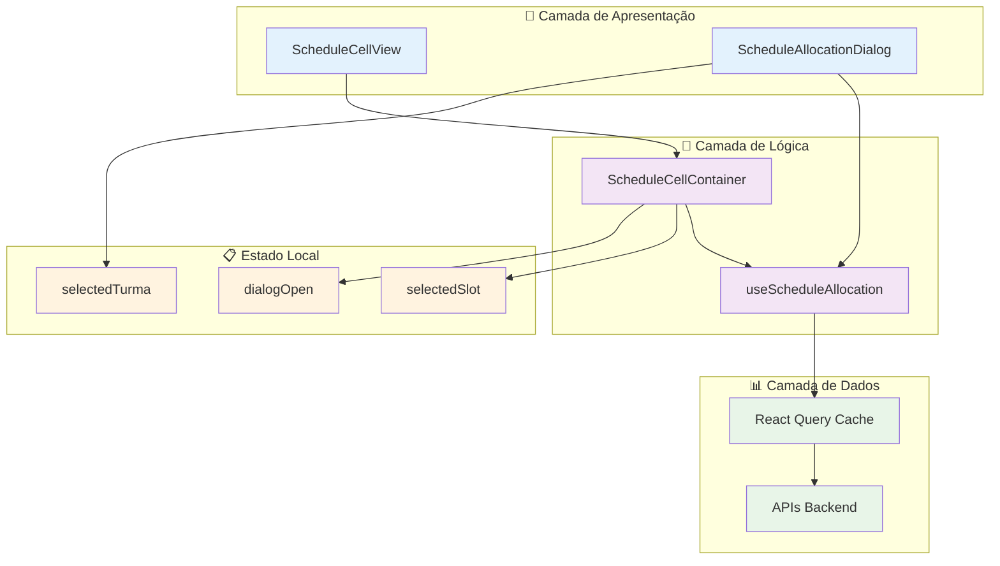
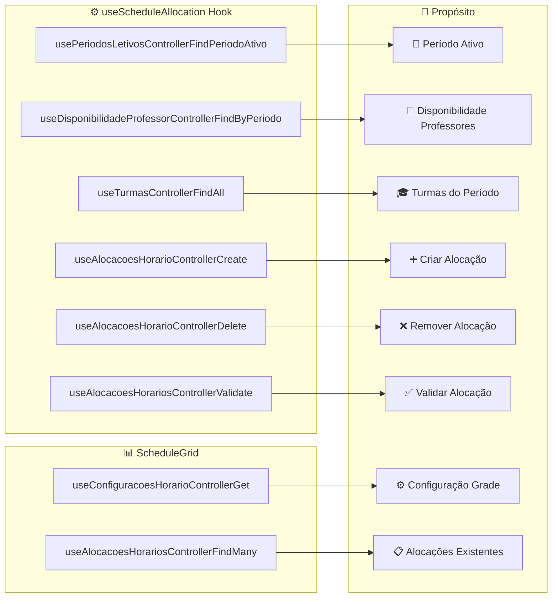
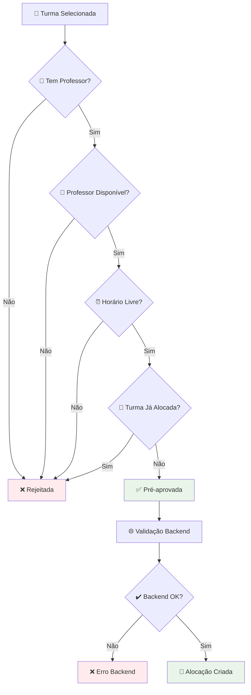

# 📅 Feature: Propostas de Horário

> **Sistema de Elaboração de Horários Acadêmicos**  
> Esta feature implementa a funcionalidade completa para coordenadores criarem e gerenciarem propostas de horários, incluindo alocação inteligente de turmas com verificação automática de disponibilidade de professores.

## 📋 Índice

1. [Visão Geral](#-visão-geral)
2. [Arquitetura de Componentes](#-arquitetura-de-componentes)
3. [Fluxo de Dados](#-fluxo-de-dados)
4. [Estrutura de Pastas](#-estrutura-de-pastas)
5. [APIs Utilizadas](#-apis-utilizadas)
6. [Como Funciona](#-como-funciona)
7. [Validações Implementadas](#-validações-implementadas)
8. [Estados da Aplicação](#-estados-da-aplicação)
9. [Exemplos de Uso](#-exemplos-de-uso)
10. [Troubleshooting](#-troubleshooting)

## 🎯 Visão Geral

A feature de **Propostas de Horário** permite que coordenadores:

- ✅ Visualizem a grade de horários baseada na configuração do sistema
- ✅ Cliquem no botão "+" para alocar turmas em slots
- ✅ Vejam apenas turmas cujos professores estão disponíveis no horário
- ✅ Adicionem múltiplas turmas por slot
- ✅ Removam turmas individuais com botão "×" no hover
- ✅ Obtenham feedback sobre conflitos e indisponibilidades
- ✅ Gerenciem alocações com validação automática

### 🎮 Fluxo do Usuário

```mermaid
graph TD
    A[👤 Coordenador visualiza grade] --> B[🔍 Identifica slot para alocação]
    B --> C[👆 Clica no botão "+" da célula]
    C --> D[📱 Modal abre com turmas disponíveis]
    D --> E{🤔 Há turmas disponíveis?}

    E -->|Sim| F[📝 Seleciona turma desejada]
    E -->|Não| G[⚠️ Mensagem: Nenhuma turma disponível]

    F --> H[✅ Confirma alocação]
    H --> I[⚡ Sistema valida automaticamente]
    I --> J{✔️ Validação OK?}

    J -->|Sim| K[💾 Alocação salva]
    J -->|Não| L[❌ Erro exibido]

    K --> M[🔄 Grade atualizada]
    L --> F
    G --> N[🔚 Fim]
    M --> N
```

## 🏗️ Arquitetura de Componentes

### Hierarquia de Componentes


```mermaid
graph TD
    A[📄 PropostasHorarioPage] --> B[📊 ScheduleGrid]
    B --> C[🌅 TurnoSection<br/>Manhã]
    B --> D[🌞 TurnoSection<br/>Tarde]
    B --> E[🌙 TurnoSection<br/>Noite]

    C --> F[📱 ScheduleCellContainer]
    D --> F
    E --> F

    F --> G[👁️ ScheduleCellView<br/>Cards de Turmas + Botões]
    F --> H[📋 ScheduleAllocationDialog<br/>Modal de Alocação]

    H --> I[⚙️ useScheduleAllocation<br/>Hook de Lógica]

    I --> J[🌐 APIs Backend]

    style A fill:#e1f5fe
    style B fill:#f3e5f5
    style C fill:#fff3e0
    style D fill:#fff3e0
    style E fill:#fff3e0
    style F fill:#e8f5e8
    style G fill:#fff8e1
    style H fill:#fff8e1
    style I fill:#fce4ec
    style J fill:#f1f8e9
```

### 📦 Responsabilidades dos Componentes

#### 📄 **PropostasHorarioPage**

- **Função**: Página principal da feature
- **Responsabilidades**:
  - Renderizar o layout base
  - Fornecer o `propostaId` para a grade
  - Gerenciar navegação e contexto da página

#### 📊 **ScheduleGrid**

- **Função**: Container principal da grade de horários
- **Responsabilidades**:
  - Buscar configurações de horário da API
  - Buscar todas as alocações existentes
  - Criar mapa otimizado de alocações
  - Renderizar seções por turno (manhã, tarde, noite)
  - Gerenciar estados de loading e erro

#### 🌅 **TurnoSection**

- **Função**: Seção específica de um turno
- **Responsabilidades**:
  - Renderizar cabeçalho do turno
  - Criar grid de horários × dias da semana
  - Passar dados para células individuais
  - Organizar layout visual do turno

#### 📱 **ScheduleCellContainer**

- **Função**: Container lógico de uma célula
- **Responsabilidades**:
  - Gerenciar estado do modal
  - Preparar dados para apresentação
  - Conectar lógica com visualização
  - Controlar abertura/fechamento do modal

#### 👁️ **ScheduleCellView**

- **Função**: Apresentação visual da célula
- **Responsabilidades**:
  - Exibir múltiplas alocações existentes ou slot vazio
  - Mostrar cards compactos para cada turma alocada
  - Botão "+" para adicionar (aparece no hover)
  - Botões "×" para remover alocações individuais
  - Layout responsivo que se expande conforme necessário

#### 📋 **ScheduleAllocationDialog**

- **Função**: Modal de gerenciamento de alocações
- **Responsabilidades**:
  - Exibir turmas disponíveis
  - Permitir seleção via combobox
  - Mostrar alocações existentes
  - Executar operações de adicionar/remover
  - Exibir estados de loading e erro

#### ⚙️ **useScheduleAllocation**

- **Função**: Hook de lógica de negócio
- **Responsabilidades**:
  - Gerenciar todas as chamadas de API
  - Filtrar turmas por disponibilidade
  - Validar alocações antes de criar
  - Gerenciar cache e invalidação
  - Fornecer funções utilitárias

## 🔄 Fluxo de Dados

### Sequência Completa de Alocação


```mermaid
sequenceDiagram
    participant 👤 as Coordenador
    participant 📱 as ScheduleCellContainer
    participant 📋 as ScheduleAllocationDialog
    participant ⚙️ as useScheduleAllocation
    participant 🌐 as Backend APIs

    Note over 👤,🌐: 🚀 Início do Fluxo

      👤->>📱: 1. Clica no botão "+" da célula
  📱->>📋: 2. Abre modal de alocação

    Note over 📋,🌐: 📊 Carregamento de Dados

    📋->>⚙️: 3. getTurmasDisponiveis()
    ⚙️->>🌐: 4. busca período ativo
    🌐-->>⚙️: 5. período ativo

    ⚙️->>🌐: 6. busca disponibilidades
    🌐-->>⚙️: 7. disponibilidades do período

    ⚙️->>🌐: 8. busca turmas
    🌐-->>⚙️: 9. turmas do período

    Note over ⚙️: 🔍 Filtragem Inteligente
    ⚙️->>⚙️: 10. isProfessorDisponivel()
    ⚙️->>⚙️: 11. temConflitoHorario()
    ⚙️-->>📋: 12. turmas filtradas

    Note over 👤,📋: 🎯 Interação do Usuário

    📋-->>👤: 13. exibe turmas disponíveis
    👤->>📋: 14. seleciona turma
    📋->>⚙️: 15. criarAlocacao()

    Note over ⚙️,🌐: ✅ Validação e Persistência

    ⚙️->>🌐: 16. validateAlocacao()
    🌐-->>⚙️: 17. validação OK
    ⚙️->>🌐: 18. createAlocacao()
    🌐-->>⚙️: 19. alocação criada

    ⚙️->>⚙️: 20. invalidateQueries()
    ⚙️-->>📋: 21. sucesso
    📋-->>👤: 22. feedback visual

    Note over 👤,🌐: 🔄 Atualização da Interface
```

### Fluxo de Dados por Camada


```mermaid
graph TB
    subgraph "🎨 Camada de Apresentação"
        A[ScheduleCellView]
        B[ScheduleAllocationDialog]
    end

    subgraph "🔧 Camada de Lógica"
        C[ScheduleCellContainer]
        D[useScheduleAllocation]
    end

    subgraph "📊 Camada de Dados"
        E[React Query Cache]
        F[APIs Backend]
    end

    subgraph "📋 Estado Local"
        G[selectedSlot]
        H[dialogOpen]
        I[selectedTurma]
    end

    A --> C
    B --> D
    C --> D
    D --> E
    E --> F

    C --> G
    C --> H
    B --> I

    style A fill:#e3f2fd
    style B fill:#e3f2fd
    style C fill:#f3e5f5
    style D fill:#f3e5f5
    style E fill:#e8f5e8
    style F fill:#e8f5e8
    style G fill:#fff3e0
    style H fill:#fff3e0
    style I fill:#fff3e0
```

## 📁 Estrutura de Pastas

```
frontend-pi/src/features/propostas-horario/
├── 📁 components/
│   ├── 📄 schedule-allocation-dialog.tsx      # Modal de alocação
│   ├── 📄 schedule-cell-container.tsx         # Container da célula
│   ├── 📄 schedule-cell-view.tsx              # Visualização da célula
│   ├── 📄 schedule-grid.tsx                   # Grade principal
│   ├── 📄 schedule-grid-types.ts              # Tipos TypeScript
│   ├── 📄 turno-section.tsx                   # Seção por turno
│   └── 📄 index.ts                            # Exportações
├── 📁 hooks/
│   ├── 📄 use-schedule-allocation.ts          # Hook principal
│   └── 📄 index.ts                            # Exportações
├── 📁 pages/
│   ├── 📄 propostas-horario-page.tsx          # Página principal
│   └── 📄 index.ts                            # Exportações
├── 📁 utils/
│   └── 📄 index.ts                            # Utilitários
└── 📄 index.ts                                # Exportações da feature
```

### 📝 Descrição dos Arquivos

| Arquivo                          | Descrição                                | Responsabilidade Principal                |
| -------------------------------- | ---------------------------------------- | ----------------------------------------- |
| `schedule-allocation-dialog.tsx` | Modal para gerenciar alocações de turmas | Interface de seleção e alocação           |
| `schedule-cell-container.tsx`    | Lógica de uma célula da grade            | Gerenciamento de estado e eventos         |
| `schedule-cell-view.tsx`         | Apresentação visual da célula            | Cards de turmas e botões de ação          |
| `schedule-grid.tsx`              | Grade completa de horários               | Orquestração da grade e mapa de alocações |
| `schedule-grid-types.ts`         | Tipos TypeScript compartilhados          | Definições de tipos                       |
| `turno-section.tsx`              | Seção de turno específico                | Layout de turno                           |
| `use-schedule-allocation.ts`     | Lógica de negócio centralizada           | APIs, validações e filtragem inteligente  |
| `propostas-horario-page.tsx`     | Página principal da feature              | Ponto de entrada                          |

## 🌐 APIs Utilizadas

### Mapeamento de APIs


```mermaid
graph LR
    subgraph "⚙️ useScheduleAllocation Hook"
        A[usePeriodosLetivosControllerFindPeriodoAtivo]
        B[useDisponibilidadeProfessorControllerFindByPeriodo]
        C[useTurmasControllerFindAll]
        D[useAlocacoesHorarioControllerCreate]
        E[useAlocacoesHorarioControllerDelete]
        F[useAlocacoesHorariosControllerValidate]
    end

    subgraph "📊 ScheduleGrid"
        G[useConfiguracoesHorarioControllerGet]
        H[useAlocacoesHorariosControllerFindMany]
    end

    subgraph "🎯 Propósito"
        I[📅 Período Ativo]
        J[👥 Disponibilidade Professores]
        K[🎓 Turmas do Período]
        L[➕ Criar Alocação]
        M[❌ Remover Alocação]
        N[✅ Validar Alocação]
        O[⚙️ Configuração Grade]
        P[📋 Alocações Existentes]
    end

    A --> I
    B --> J
    C --> K
    D --> L
    E --> M
    F --> N
    G --> O
    H --> P
```

### 📋 Detalhamento das APIs

#### 🔍 **APIs de Consulta (Queries)**

| API                                             | Hook                                                 | Propósito                    | Dados Retornados                 |
| ----------------------------------------------- | ---------------------------------------------------- | ---------------------------- | -------------------------------- |
| `GET /periodos-letivos/ativo`                   | `usePeriodosLetivosControllerFindPeriodoAtivo`       | Busca período letivo ativo   | `PeriodoLetivoResponseDto`       |
| `GET /disponibilidade-professores/periodo/{id}` | `useDisponibilidadeProfessorControllerFindByPeriodo` | Disponibilidades do período  | `DisponibilidadeResponseDto[]`   |
| `GET /turmas`                                   | `useTurmasControllerFindAll`                         | Turmas filtradas por período | `TurmaResponseDto[]`             |
| `GET /configuracoes-horario`                    | `useConfiguracoesHorarioControllerGet`               | Configuração da grade        | `ConfiguracaoHorarioResponseDto` |
| `GET /alocacoes-horarios`                       | `useAlocacoesHorariosControllerFindMany`             | Alocações existentes         | `AlocacaoHorarioResponseDto[]`   |

#### ⚡ **APIs de Mutação (Mutations)**

| API                                 | Hook                                     | Propósito        | Payload                    |
| ----------------------------------- | ---------------------------------------- | ---------------- | -------------------------- |
| `POST /alocacoes-horarios/validate` | `useAlocacoesHorariosControllerValidate` | Validar alocação | `ValidateAlocacaoDto`      |
| `POST /alocacoes-horarios`          | `useAlocacoesHorarioControllerCreate`    | Criar alocação   | `CreateAlocacaoHorarioDto` |
| `DELETE /alocacoes-horarios/{id}`   | `useAlocacoesHorarioControllerDelete`    | Remover alocação | `{ id: string }`           |

## 🔧 Como Funciona

### 1. 🚀 Inicialização da Grade

```typescript
// ScheduleGrid.tsx
export function ScheduleGrid({ propostaId }: ScheduleGridProps) {
  // 1. Busca configurações de horário
  const { data: configuracao } = useConfiguracoesHorarioControllerGet()

  // 2. Busca todas as alocações existentes
  const { data: alocacoes } = useAlocacoesHorariosControllerFindMany({})

  // 3. Cria mapa otimizado para busca rápida (suporta múltiplas alocações por slot)
  const alocacoesMap = useMemo(() => {
    const map = new Map()
    alocacoes?.forEach(alocacao => {
      const key = `${alocacao.diaDaSemana}_${alocacao.horaInicio}`
      if (map.has(key)) {
        map.get(key).push(alocacao) // Adiciona à lista existente
      } else {
        map.set(key, [alocacao]) // Cria nova lista
      }
    })
    return map
  }, [alocacoes])

  // 4. Renderiza seções por turno
  return (
    <div>
      <TurnoSection
        titulo="Manhã"
        aulas={configuracao.aulasTurnoManha}
        inicio={configuracao.inicioTurnoManha}
        fim={configuracao.fimTurnoManhaCalculado}
        alocacoesMap={alocacoesMap}
        propostaId={propostaId}
        todasAlocacoes={alocacoes}
      />
      {/* Turnos Tarde e Noite também renderizados */}
    </div>
  )
}
```

### 2. 📱 Interação com Célula

```typescript
// ScheduleCellContainer.tsx
export function ScheduleCellContainer({ dia, horario, propostaId, alocacoes }) {
  const [dialogOpen, setDialogOpen] = useState(false)

  // Gerencia loading states e operações
  const { isCreating, isDeleting, removerAlocacao } = useScheduleAllocation(propostaId)

  const handleAddClick = () => {
    setDialogOpen(true) // Abre modal para adicionar
  }

  const handleRemoveAlocacao = async (alocacaoId: string) => {
    await removerAlocacao(alocacaoId) // Remove alocação diretamente
  }

  return (
    <>
      <ScheduleCellView
        alocacoes={alocacoes}
        onAddClick={handleAddClick}
        onRemoveAlocacao={handleRemoveAlocacao}
        isLoading={isCreating || isDeleting}
      />
      <ScheduleAllocationDialog
        propostaId={propostaId}
        open={dialogOpen}
        onOpenChange={setDialogOpen}
        dia={dia}
        horario={horario}
      />
    </>
  )
}
```

### 3. 🧠 Lógica de Negócio (Hook)

```typescript
// use-schedule-allocation.ts
export function useScheduleAllocation(propostaId: string) {
  // 1. Busca dados necessários
  const { data: periodoAtivo } = usePeriodosLetivosControllerFindPeriodoAtivo()
  const { data: disponibilidades } =
    useDisponibilidadeProfessorControllerFindByPeriodo(periodoAtivo?.id || "", {
      status: "DISPONIVEL",
    })
  const { data: turmas } = useTurmasControllerFindAll({
    idPeriodoLetivo: periodoAtivo?.id,
  })

  // 2. Função de verificação de disponibilidade
  function isProfessorDisponivel(professorId, diaSemana, horaInicio, horaFim) {
    return disponibilidades.some(
      (d) =>
        d.usuarioProfessor.id === professorId &&
        d.diaDaSemana === diaSemana &&
        d.horaInicio <= horaInicio &&
        d.horaFim >= horaFim &&
        d.status === "DISPONIVEL",
    )
  }

  // 3. Filtragem inteligente de turmas
  const getTurmasDisponiveis = useCallback(
    (dia, horaInicio, horaFim, alocacoesExistentes, todasAlocacoes) => {
      return turmas.filter((turma) => {
        // Verificações:
        // ✅ Não está já alocada neste slot
        // ✅ Tem professor atribuído
        // ✅ Professor está disponível no horário
        // ✅ Não há conflitos de horário

        if (!turma.professorAlocado) return false

        if (
          !isProfessorDisponivel(
            turma.professorAlocado.id,
            dia,
            horaInicio,
            horaFim,
          )
        ) {
          return false
        }

        const { temConflito } = temConflitoHorario(
          turma,
          dia,
          horaInicio,
          horaFim,
          todasAlocacoes,
        )
        return !temConflito
      })
    },
    [turmas, disponibilidades],
  )

  return { getTurmasDisponiveis, criarAlocacao, removerAlocacao }
}
```

### 4. 🎯 Modal de Alocação

```typescript
// ScheduleAllocationDialog.tsx
export function ScheduleAllocationDialog({ propostaId, dia, horario }) {
  const { getTurmasDisponiveis, criarAlocacao } = useScheduleAllocation(propostaId)

  // Obtém turmas disponíveis automaticamente
  const turmasDisponiveis = useMemo(() => {
    return getTurmasDisponiveis(dia, horario.inicio, horario.fim, alocacoesExistentes, todasAlocacoes)
  }, [getTurmasDisponiveis, dia, horario, alocacoesExistentes, todasAlocacoes])

  const handleAdicionarTurma = async () => {
    if (selectedTurma) {
      await criarAlocacao(selectedTurma, dia, horario.inicio, horario.fim)
      // Modal fecha automaticamente em caso de sucesso
    }
  }

  return (
    <Dialog>
      {/* Lista de alocações existentes (removíveis) */}
      {alocacoesExistentes.map(alocacao => (
        <TurmaCard
          key={alocacao.id}
          alocacao={alocacao}
          onRemove={handleRemover}
        />
      ))}

      {/* Combobox para adicionar nova turma */}
      <Command>
        <CommandItem value={turma.id}>
          <div>
            <Badge>{turma.codigoDaTurma}</Badge>
            <div>{turma.disciplinaOfertada?.disciplina?.nome}</div>
            <span className="text-muted-foreground">
              {turma.professorAlocado?.nome}
            </span>
          </div>
        </CommandItem>
      </Command>
    </Dialog>
  )
}
```

## ✅ Validações Implementadas

### 🔍 Matriz de Validações

| Validação                   | Onde é Feita            | Função Responsável         | Impacto           |
| --------------------------- | ----------------------- | -------------------------- | ----------------- |
| 👥 **Professor Disponível** | `useScheduleAllocation` | `isProfessorDisponivel()`  | Filtra turmas     |
| 👤 **Professor Atribuído**  | `useScheduleAllocation` | `getTurmasDisponiveis()`   | Filtra turmas     |
| ⏰ **Conflito de Horário**  | `useScheduleAllocation` | `temConflitoHorario()`     | Filtra turmas     |
| 🚫 **Turma Já Alocada**     | `useScheduleAllocation` | `getTurmasDisponiveis()`   | Filtra turmas     |
| ✅ **Validação Backend**    | `useScheduleAllocation` | `validateAlocacao()`       | Antes de criar    |
| 🔒 **Sobreposição**         | `useScheduleAllocation` | `temSobreposicaoHorario()` | Previne conflitos |

### 🛡️ Fluxo de Validação


```mermaid
graph TD
    A[🎯 Turma Selecionada] --> B{👤 Tem Professor?}
    B -->|Não| C[❌ Rejeitada]
    B -->|Sim| D{👥 Professor Disponível?}

    D -->|Não| C
    D -->|Sim| E{⏰ Horário Livre?}

    E -->|Não| C
    E -->|Sim| F{🚫 Turma Já Alocada?}

    F -->|Sim| C
    F -->|Não| G[✅ Pré-aprovada]

    G --> H[🌐 Validação Backend]
    H --> I{✔️ Backend OK?}

    I -->|Não| J[❌ Erro Backend]
    I -->|Sim| K[💾 Alocação Criada]

    style C fill:#ffebee
    style G fill:#e8f5e8
    style K fill:#e8f5e8
    style J fill:#ffebee
```

## 📊 Estados da Aplicação

### 🔄 Estados do Hook

```typescript
interface ScheduleAllocationState {
  // 📊 Dados
  turmas: TurmaResponseDto[]
  disponibilidades: DisponibilidadeResponseDto[]
  periodoAtivo: PeriodoLetivoResponseDto | null

  // ⏳ Loading States
  isLoadingTurmas: boolean
  isLoadingDisponibilidades: boolean
  isCreating: boolean
  isDeleting: boolean
  isValidating: boolean

  // 🎯 Funções
  getTurmasDisponiveis: (
    dia,
    inicio,
    fim,
    existentes,
    todas,
  ) => TurmaResponseDto[]
  criarAlocacao: (turmaId, dia, inicio, fim) => Promise<void>
  removerAlocacao: (alocacaoId) => Promise<void>
  validateAlocacao: (turmaId, dia, inicio, fim) => Promise<ValidationResult>
}
```

### 🎨 Estados da UI

```typescript
// ScheduleCellContainer
interface CellState {
  dialogOpen: boolean // Modal aberto/fechado
  isLoading: boolean // Operação em andamento
}

// ScheduleAllocationDialog
interface DialogState {
  openCombobox: boolean // Combobox aberto/fechado
  selectedTurma: string // Turma selecionada no combobox
}

// ScheduleGrid
interface GridState {
  configuracao: ConfiguracaoHorarioResponseDto | null
  alocacoes: AlocacaoHorarioResponseDto[]
  alocacoesMap: Map<string, AlocacaoHorarioResponseDto>
  isLoading: boolean
  error: Error | null
}
```

## 🎓 Exemplos de Uso

### 1. 🚀 Uso Básico

```tsx
import { ScheduleGrid } from "@/features/propostas-horario"

function MinhaPageDeHorarios() {
  return (
    <div>
      <h1>Propostas de Horário</h1>
      <ScheduleGrid
        propostaId="proposta-2024-1"
        className="w-full"
      />
    </div>
  )
}
```

### 2. 🎯 Uso Avançado com Context

```tsx
import { PropostaHorarioProvider } from "@/features/propostas-horario"

function App() {
  return (
    <PropostaHorarioProvider propostaId="proposta-2024-1">
      <div>
        <Header />
        <ScheduleGrid />
        <Sidebar />
      </div>
    </PropostaHorarioProvider>
  )
}
```

### 3. 🔧 Hook Standalone

```tsx
import { useScheduleAllocation } from "@/features/propostas-horario/hooks"

function MeuComponenteCustomizado() {
  const { getTurmasDisponiveis, criarAlocacao, isCreating } =
    useScheduleAllocation("proposta-2024-1")

  const turmasDisponiveis = getTurmasDisponiveis(
    "SEGUNDA",
    "08:00",
    "08:50",
    [],
    [],
  )

  const handleAlocar = async (turmaId: string) => {
    await criarAlocacao(turmaId, "SEGUNDA", "08:00", "08:50")
  }

  return (
    <div>
      {turmasDisponiveis.map((turma) => (
        <button
          key={turma.id}
          onClick={() => handleAlocar(turma.id)}
          disabled={isCreating}
        >
          {turma.codigoDaTurma}
        </button>
      ))}
    </div>
  )
}
```

## 🔧 Troubleshooting

### ❓ Problemas Comuns

#### 1. 🚫 "Nenhuma turma disponível"

**Possíveis Causas:**

- ❌ Nenhum período letivo ativo
- ❌ Professores não definiram disponibilidade
- ❌ Todas as turmas já alocadas
- ❌ Conflitos de horário

**Soluções:**

```typescript
// Verificar período ativo
const { data: periodo } = usePeriodosLetivosControllerFindPeriodoAtivo()
console.log("Período ativo:", periodo)

// Verificar disponibilidades
const { data: disponibilidades } =
  useDisponibilidadeProfessorControllerFindByPeriodo(periodo?.id || "")
console.log("Disponibilidades:", disponibilidades)
```

#### 2. ⏳ Loading infinito

**Possíveis Causas:**

- ❌ API não responde
- ❌ Erro de autenticação
- ❌ Dados malformados
- ❌ Período letivo não ativo

**Soluções:**

```typescript
// Verificar erros
const { data, error, isLoading } = useConfiguracoesHorarioControllerGet()
const { data: periodo } = usePeriodosLetivosControllerFindPeriodoAtivo()

if (error) {
  console.error("Erro na API:", error)
}

if (!periodo) {
  console.warn("Nenhum período letivo ativo encontrado")
}

if (isLoading) {
  console.log("Carregando dados...")
}
```

#### 3. 💥 Erro ao criar alocação

**Possíveis Causas:**

- ❌ Validação falhou no backend
- ❌ Dados inconsistentes
- ❌ Professor não disponível

**Solução:**

```typescript
try {
  await criarAlocacao(turmaId, dia, inicio, fim)
} catch (error) {
  console.error("Erro detalhado:", error.response?.data)
}
```

### 🔍 Debug Mode

Para ativar logs detalhados:

```typescript
// No hook useScheduleAllocation
const DEBUG = process.env.NODE_ENV === "development"

if (DEBUG) {
  console.log("🎯 Turmas encontradas:", turmas)
  console.log("👥 Disponibilidades:", disponibilidades)
  console.log("📅 Período ativo:", periodoAtivo)
}
```

### 📊 Monitoramento de Performance

```typescript
// Métricas úteis para debugging
const metrics = {
  totalTurmas: turmas?.length || 0,
  turmasDisponiveis: turmasDisponiveis.length,
  totalDisponibilidades: disponibilidades?.length || 0,
  tempoResposta: Date.now() - startTime,
}

console.table(metrics)
```

---

## 🎉 Conclusão

A feature de **Propostas de Horário** implementa um sistema completo e robusto para gerenciamento de horários acadêmicos, com:

- ✅ **Arquitetura modular** e bem estruturada
- ✅ **Validações inteligentes** automáticas
- ✅ **Interface intuitiva** e responsiva
- ✅ **Performance otimizada** com cache
- ✅ **Extensibilidade** para futuras melhorias

> 💡 **Dica**: Para entender melhor o funcionamento, recomenda-se seguir o fluxo de dados começando pela página principal e descendo até os hooks de API.

---

**📝 Última atualização**: 07/06/2025  
**👥 Mantido por**: Equipe de Desenvolvimento Frontend
